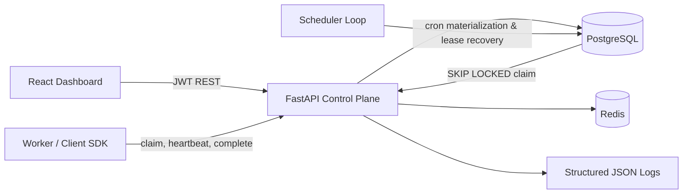
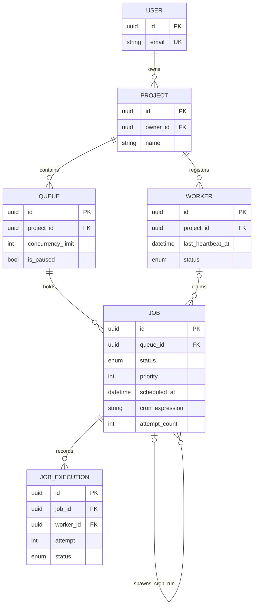

# Chronos — Distributed Job Scheduler

Chronos is a production-oriented, multi-tenant queue control plane built around PostgreSQL's transactional guarantees. It supports priority and delayed jobs, recurring cron schedules, configurable retries, dead-letter handling, worker leases, execution auditing, and an operational React dashboard.

## Quick start

```bash
cp .env.example .env
docker compose up --build
```

Open the dashboard at `http://localhost:5173` and Swagger at `http://localhost:8000/docs`. Register the first user through `POST /api/v1/auth/register`, then sign in. Create a project and queue through Swagger before using the dashboard.

```bash
curl -X POST http://localhost:8000/api/v1/auth/register \
  -H "Content-Type: application/json" \
  -d '{"email":"admin@example.com","password":"password123","full_name":"Admin"}'
```

## Architecture



PostgreSQL is the source of truth. Job claims use a row lock with `FOR UPDATE SKIP LOCKED`; competing workers never receive the same job. Queue concurrency is checked in the same transaction. Redis is provisioned for high-volume event fan-out and cache evolution without weakening database correctness.

## Data model



## Scheduling semantics

- Priority is descending; scheduled time and creation time provide stable FIFO ordering.
- Delayed jobs remain queued but cannot be claimed until `scheduled_at`.
- Cron definitions are templates (`scheduled`); the scheduler atomically creates independent run jobs and advances `next_run_at`.
- Retry delays are fixed (`d`), linear (`d × attempt`), or exponential (`d × 2^(attempt-1)`), capped at 24 hours.
- Exhausted jobs enter `dead`; operators can explicitly requeue them.
- Worker heartbeats form a lease. Expired workers become offline and their in-flight jobs are recovered or dead-lettered.
- `idempotency_key` is unique within a queue, preventing duplicate submissions.

## API surface

All resource APIs are tenant-scoped through project ownership. Main routes:

- `/auth/register`, `/auth/login`, `/auth/me`
- `/projects`, `/queues`, `/jobs`
- `/jobs/{id}/cancel`, `/requeue`, `/executions`
- `/workers`, `/heartbeat`, `/claim`, `/complete`
- `/metrics`, `/health`

Pagination and status filtering are available on job listing. OpenAPI documents exact request and response contracts.

## Running a worker

The included reference worker demonstrates the complete worker protocol:

```bash
docker compose run --rm \
  -e WORKER_TOKEN=... -e PROJECT_ID=... -e QUEUE_ID=... \
  api python -m app.worker
```

Job payload `{ "duration": 2 }` simulates work; `{ "fail": true }` exercises retry/DLQ behavior. In a real deployment, replace `execute()` with a handler registry or isolated execution runtime.

## Development and operations

```bash
make test       # backend unit tests in the API image
make migrate    # apply Alembic migrations
make logs       # follow structured API logs
```

Production deployments should inject secrets from a secret manager, terminate TLS at the ingress, run the scheduler as a singleton/elected process, set connection pool limits per replica, and export metrics to Prometheus. The scheduler operations are row-locked and safe if briefly overlapped, but leader election avoids unnecessary polling.

## Design trade-offs

The HTTP pull-worker protocol makes execution language-agnostic and keeps the control plane independent from Celery internals. PostgreSQL provides durable ordering and exactly-once *claiming*; execution remains at-least-once because a process can finish work and die before acknowledging. Idempotent job handlers are therefore required for side effects—the same contract used by mature distributed queues.
